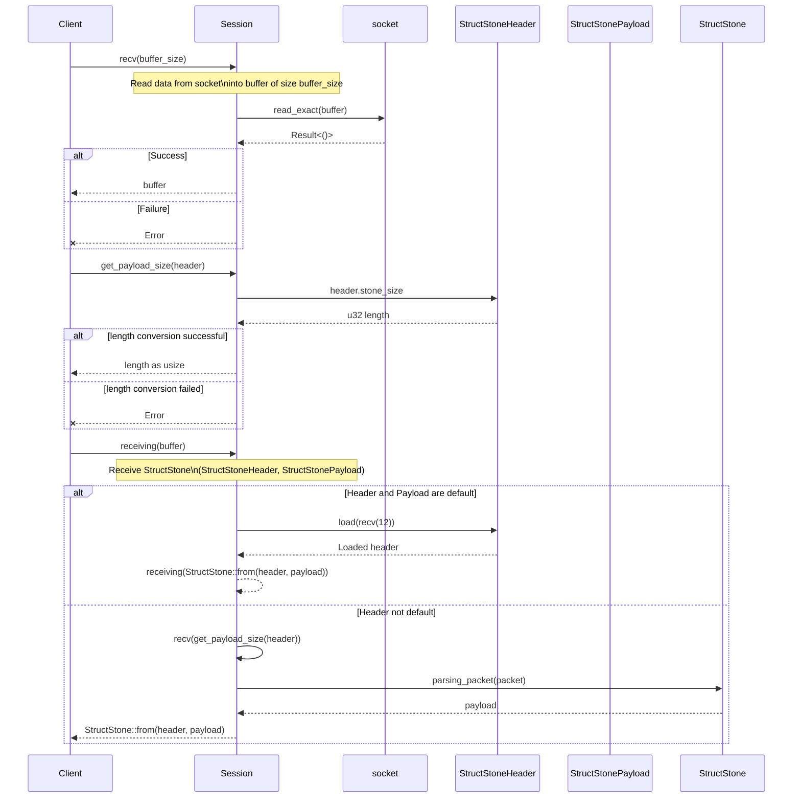

```mermaid
sequenceDiagram
    participant Client
    participant Session
    participant socket
    participant StructStoneHeader
    participant StructStonePayload

    Client->>Session: recv(buffer_size)
    Note over Session: Read data from socket\ninto buffer of size buffer_size
    Session->>socket: read_exact(buffer)
    socket-->>Session: Result<()>
    alt Success
        Session-->>Client: buffer
    else Failure
        Session--xClient: Error
    end

    Client->>Session: get_payload_size(header)
    Session->>StructStoneHeader: header.stone_size
    StructStoneHeader-->>Session: u32 length
    alt length conversion successful
        Session-->>Client: length as usize
    else length conversion failed
        Session--xClient: Error
    end

    Client->>Session: receiving(buffer)
    Note over Session: Receive StructStone\n(StructStoneHeader, StructStonePayload)
    alt Header and Payload are default
        Session->>StructStoneHeader: load(recv(12))
        StructStoneHeader-->>Session: Loaded header
        Session-->>Session: receiving(StructStone::from(header, payload))
    else Header not default
        Session->>Session: recv(get_payload_size(header))
        Session->>StructStone: parsing_packet(packet)
        StructStone-->>Session: payload
        Session-->>Client: StructStone::from(header, payload)
    end

```