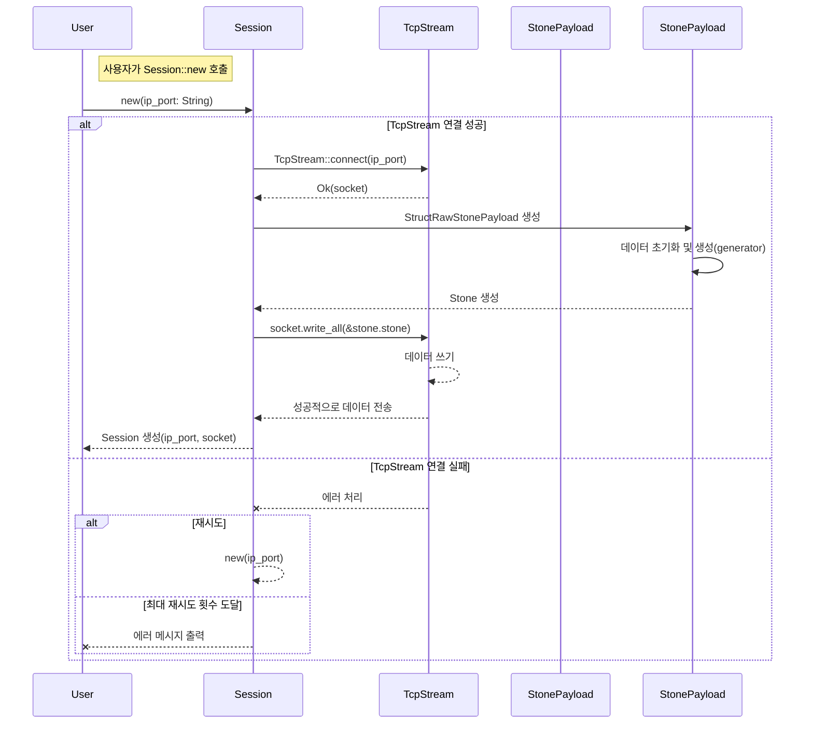

```mermaid
sequenceDiagram
    participant User as User
    participant Session as Session
    participant TcpStream as TcpStream
    participant StructRawStonePayload as StonePayload
    Note right of User: 사용자가 Session::new 호출

    User->>Session: new(ip_port: String)
    alt TcpStream 연결 성공
        Session->>TcpStream: TcpStream::connect(ip_port)
        TcpStream-->>Session: Ok(socket)
        Session->>StonePayload: StructRawStonePayload 생성
        StonePayload->>StonePayload: 데이터 초기화 및 생성(generator)
        StonePayload-->>Session: Stone 생성
        Session->>TcpStream: socket.write_all(&stone.stone)
        TcpStream-->>TcpStream: 데이터 쓰기
        TcpStream-->>Session: 성공적으로 데이터 전송
        Session-->>User: Session 생성(ip_port, socket)
    else TcpStream 연결 실패
        TcpStream--xSession: 에러 처리
        alt 재시도
            Session-->>Session: new(ip_port)
        else 최대 재시도 횟수 도달
            Session--xUser: 에러 메시지 출력
        end
    end
```

