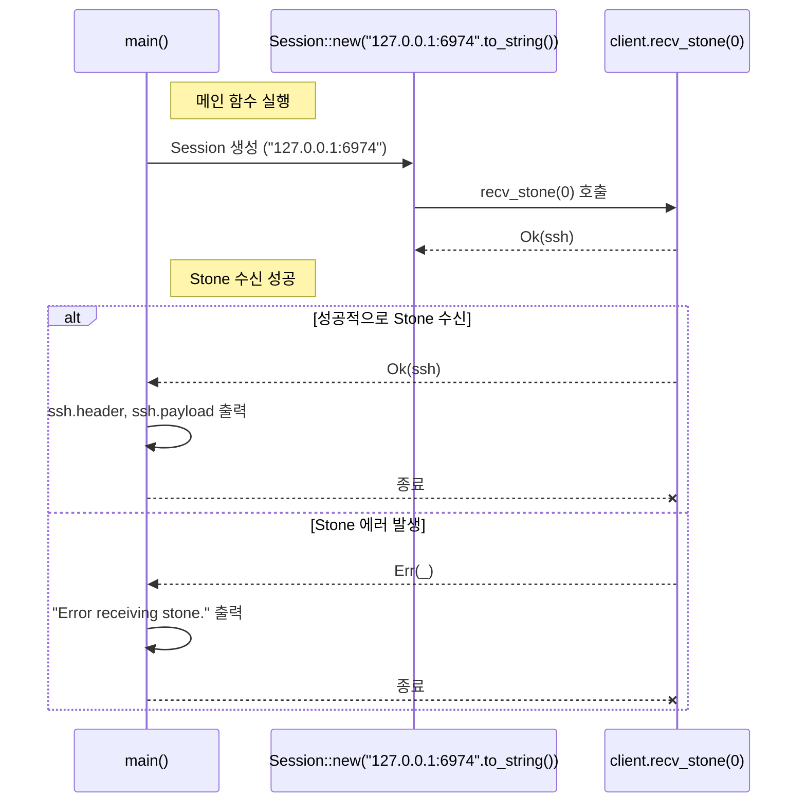

```mermaid
sequenceDiagram
    participant Main as main()
    participant Client as Session::new("127.0.0.1:6974".to_string())
    participant Stone as client.recv_stone(0)
    Note right of Main: 메인 함수 실행

    Main->>Client: Session 생성 ("127.0.0.1:6974")
    Client->>Stone: recv_stone(0) 호출
    Stone-->>Client: Ok(ssh)
    Note right of Main: Stone 수신 성공

    alt 성공적으로 Stone 수신
        Stone-->>Main: Ok(ssh)
        Main->>Main: ssh.header, ssh.payload 출력
        Main--x Stone: 종료
    else Stone 에러 발생
        Stone-->>Main: Err(_)
        Main->>Main: "Error receiving stone." 출력
        Main--x Stone: 종료
    end
```