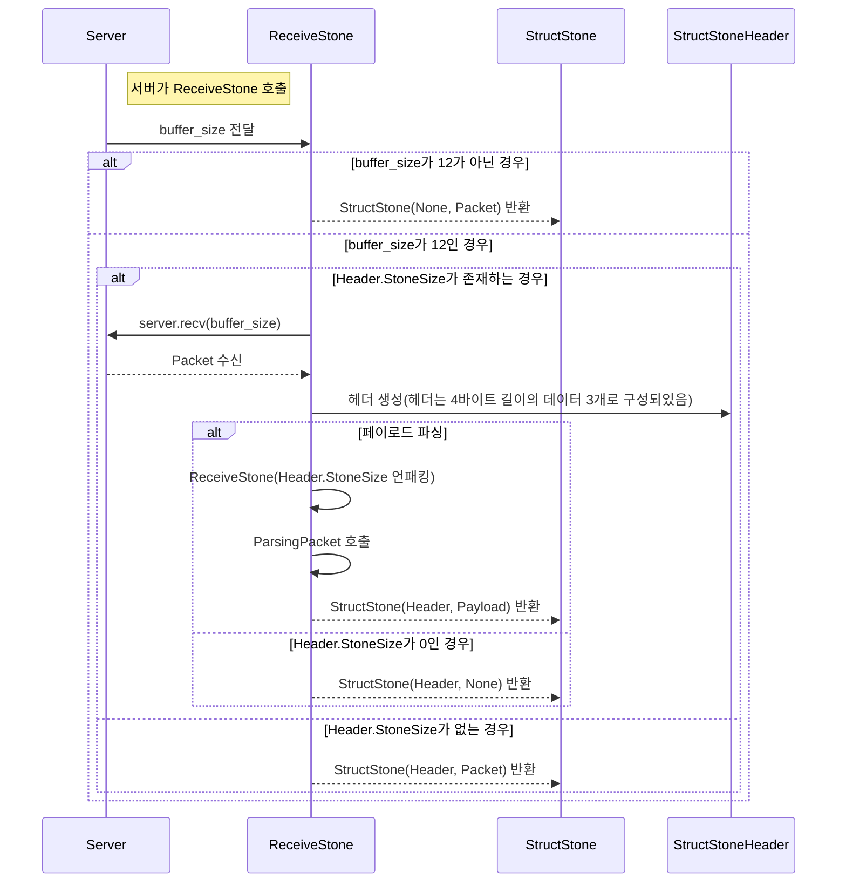

```mermaid
sequenceDiagram
    participant Server as Server
    participant ReceiveStone as ReceiveStone
    participant StructStone as StructStone
    participant StructStoneHeader as StructStoneHeader

    Note right of Server: 서버가 ReceiveStone 호출
    Server->>ReceiveStone: buffer_size 전달
    alt buffer_size가 12가 아닌 경우
        ReceiveStone-->>StructStone: StructStone(None, Packet) 반환
    else buffer_size가 12인 경우
        alt Header.StoneSize가 존재하는 경우
            ReceiveStone->>Server: server.recv(buffer_size)
            Server-->>ReceiveStone: Packet 수신
            ReceiveStone->>StructStoneHeader: 헤더 생성(헤더는 4바이트 길이의 데이터 3개로 구성되있음)
            alt 페이로드 파싱
                ReceiveStone->>ReceiveStone: ReceiveStone(Header.StoneSize 언패킹)
                ReceiveStone->>ReceiveStone: ParsingPacket 호출
                ReceiveStone-->>StructStone: StructStone(Header, Payload) 반환
            else Header.StoneSize가 0인 경우
                ReceiveStone-->>StructStone: StructStone(Header, None) 반환
            end
        else Header.StoneSize가 없는 경우
            ReceiveStone-->>StructStone: StructStone(Header, Packet) 반환
        end
    end

```