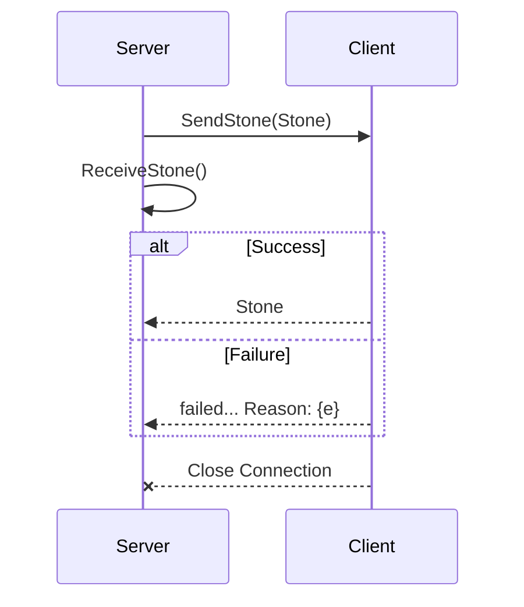

```mermaid
sequenceDiagram
    participant Server
    participant Client

    Server->>Client: SendStone(Stone)
    Server->>Server: ReceiveStone()
    alt Success
        Client-->>Server: Stone
    else Failure
        Client-->>Server: failed... Reason: {e}
    end
    Client--xServer: Close Connection


```