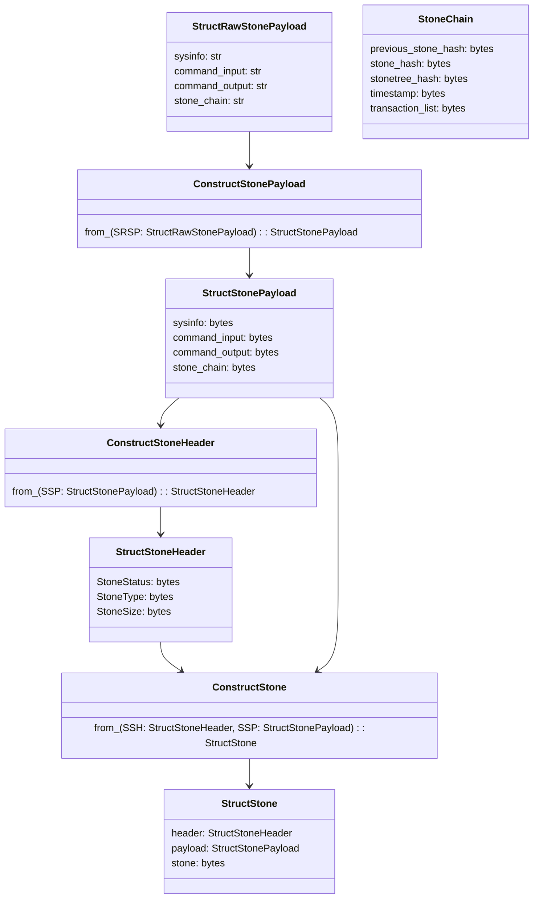

```mermaid
classDiagram
    class StructRawStonePayload {
        sysinfo: str
        command_input: str
        command_output: str
        stone_chain: str
    }
    class StructStonePayload {
        sysinfo: bytes
        command_input: bytes
        command_output: bytes
        stone_chain: bytes
    }
    class StructStoneHeader {
        StoneStatus: bytes
        StoneType: bytes
        StoneSize: bytes
    }
    class StructStone {
        header: StructStoneHeader
        payload: StructStonePayload
        stone: bytes
    }
    class StoneChain {
        previous_stone_hash: bytes
        stone_hash: bytes
        stonetree_hash: bytes
        timestamp: bytes
        transaction_list: bytes
    }
    class ConstructStonePayload {
        from_(SRSP: StructRawStonePayload): StructStonePayload
    }
    class ConstructStoneHeader {
        from_(SSP: StructStonePayload): StructStoneHeader
    }
    class ConstructStone {
        from_(SSH: StructStoneHeader, SSP: StructStonePayload): StructStone
    }

    StructRawStonePayload --> ConstructStonePayload
    ConstructStonePayload --> StructStonePayload
    StructStonePayload --> ConstructStoneHeader
    ConstructStoneHeader --> StructStoneHeader
    StructStoneHeader --> ConstructStone
    StructStonePayload --> ConstructStone
    ConstructStone --> StructStone
```